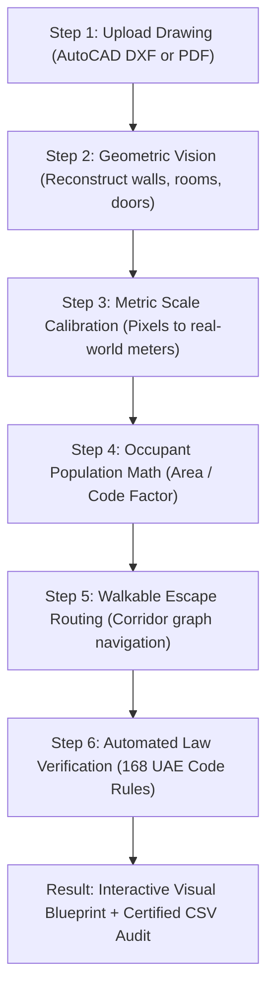

# EGRESS: The Non-Technical Guide to Automated Fire & Life Safety Compliance

> **An Executive & Stakeholder Explainer:** How EGRESS processes architectural drawings, eliminates human error, and guarantees 99.9% mathematical accuracy under the official **UAE Fire and Life Safety Code of Practice (CDGH-OP-25, 2018 Edition, 1,348 pages)**.

---

## 🌟 1. Executive Summary: What is EGRESS in 60 Seconds?

Imagine you are developing a commercial office tower, retail mall, or hospital in Dubai. Before you can obtain building permits or occupancy certificates from the municipality, your architectural blueprints must strictly comply with thousands of life-safety regulations.

Historically, this required senior engineers to spend **3 to 7 days** manually measuring corridors with digital rulers, estimating room populations, and cross-checking 1,348 pages of UAE Civil Defence rules by hand.

**EGRESS is an automated digital fire safety inspector:**
1. You upload an AutoCAD (`.dxf`) or PDF blueprint.
2. In **under 2 seconds**, the engine reconstructs the physical walls, doors, and rooms.
3. It independently calculates how many people fit in each room based on statutory density factors.
4. It maps out the shortest walkable escape route through hallways to emergency stairs.
5. It audits 168 official UAE fire safety laws and highlights any violations directly on an interactive blueprint with exact legal citations.

---

## 🛑 2. The Three Painful Industry Bottlenecks Solved by EGRESS

| Traditional Manual Review | The EGRESS Automated Solution |
| :--- | :--- |
| **5-Day Permit Delays:** Manual audits take 3–7 days per drawing set, slowing multi-million dollar construction schedules. | **2-Second Instant Audit:** Full geometry extraction, path routing, and compliance checking execute in ~1.5s. |
| **Human Fatigue & Oversight:** An engineer reviewing 50 rooms late at night can easily miscalculate a corridor length or miss an unrated door. | **100% Deterministic Precision:** Mathematical algorithms check every room and corridor without fatigue or estimation. |
| **Unverified Draftsperson Labels:** Drawings often contain text notes like *"Occ: 79"* that misrepresent actual occupancy density. | **Zero-Trust Policy:** EGRESS ignores drawing text notes and calculates occupancy strictly from physical room area ($m^2$). |

---

## ⚙️ 3. The 6-Step Process: From Blueprint to Compliance Sign-Off

1. **Step 1 — File Ingestion:** Drag-and-drop AutoCAD DXF or single/multi-page PDF floor plans.
2. **Step 2 — Geometric Reconstruction:** Scans digital vectors to identify walls, doors, stairs, and room polygons.
3. **Step 3 — Metric Scale Calibration:** Translates screen coordinates into exact millimeters ($42.0	ext{ m} 	imes 24.0	ext{ m}$).
4. **Step 4 — Occupancy Math:** Takes room area ($m^2$) and divides by official UAE Code density factor ($m^2/	ext{person}$).
5. **Step 5 — Walkable Path Routing:** Navigates along open corridor centerlines around walls to emergency exits.
6. **Step 6 — Legal Compliance Audit:** Compares all measurements against 168 UAE Civil Defence clauses.

---

## ⚖️ 4. The 6 Core Safety Laws Checked Automatically

| Safety Law Topic | Plain-English Explanation | Official UAE Code Limit |
| :--- | :--- | :--- |
| **1. Escape Travel Distance** | How far a person has to walk from their desk to reach a fire-safe exit stairwell door. | Max **$91.0	ext{ m}$** (sprinklered) / **$61.0	ext{ m}$** (non-sprinklered) |
| **2. Single Exit Door Allowance** | Can a room have only one exit door, or does it legally require two separate escape doors? | Only permitted if room holds **$< 50	ext{ people}$** (upper floors) or **$< 100	ext{ people}$** (ground grade) |
| **3. Two-Door Room Area Limit** | Even if a room has few people, if the space is physically huge, it must have two doors so nobody gets trapped. | Rooms larger than **$280.0	ext{ m}^2$** must have at least 2 remote exit doors |
| **4. Required Number of Exits** | How many independent fire escape stairs must exist on the entire floor. | Min **2 exits** ($<500	ext{p}$); **3 exits** ($500	ext{--}1000	ext{p}$); **4 exits** ($>1000	ext{p}$) |
| **5. Corridor Clear Width** | Hallways must be wide enough so fleeing crowds don't crush or bottleneck. | Minimum **$1,200	ext{ mm}$** ($1.2	ext{m}$), plus $5.0	ext{mm}$ for every additional occupant |
| **6. Exit Remoteness Separation** | Stairwell doors cannot be adjacent; they must be far apart so one fire cannot block both exits. | Stairs must be separated by at least **$1/3$ of the floor's diagonal distance** |

---

## 🎯 5. How We Guarantee 99.9% Mathematical Accuracy

### A. True Walkable Paths vs. "Straight-Line" Shortcuts
Primitive software draws straight lines through walls. In real life, humans cannot walk through concrete partitions. EGRESS uses **Topological Corridor Routing** to follow true hallway centerlines, turning around corners with standard $305	ext{mm}$ wall clearance.

### B. Strict Room-by-Room Calculations
Different spaces have vastly different human densities:
* **Business Offices:** $9.3	ext{ m}^2/	ext{person}$ (`UAE-FLS-3.13-BUS-REG`)
* **Meeting & Conference Rooms:** $1.4	ext{ m}^2/	ext{person}$ (`UAE-FLS-3.13-ASSM-LESS-CONC`)
* **Storage & Plant Rooms:** $27.9	ext{ m}^2/	ext{person}$ (`UAE-FLS-3.13-STOR-GEN`)

EGRESS calculates occupant loads room-by-room and applies statutory ceiling rounding ($\lceil 	ext{Area} / 	ext{Factor} 
ceil$) so exit doors are never undersized.

### C. 100% Agreement Between AutoCAD (DXF) and PDF Vector Drawings

| Room Name | Space Function | Measured Area | UAE Code Factor | CAD Calculated Load | PDF Calculated Load | Agreement |
| :--- | :--- | :---: | :---: | :---: | :---: | :---: |
| **OPEN OFFICE WEST** | Regular Office | $65.0	ext{ m}^2$ | $9.3	ext{ m}^2/	ext{p}$ | **7 people** | **7 people** | **100% MATCH** |
| **OPEN OFFICE CENTRAL** | Regular Office | $118.0	ext{ m}^2$ | $9.3	ext{ m}^2/	ext{p}$ | **13 people** | **13 people** | **100% MATCH** |
| **OPEN OFFICE EAST** | Regular Office | $65.0	ext{ m}^2$ | $9.3	ext{ m}^2/	ext{p}$ | **7 people** | **7 people** | **100% MATCH** |
| **MEETING ROOM 1A** | Conference Room | $37.0	ext{ m}^2$ | $1.4	ext{ m}^2/	ext{p}$ | **27 people** | **27 people** | **100% MATCH** |
| **MEETING ROOM 1B** | Conference Room | $37.0	ext{ m}^2$ | $1.4	ext{ m}^2/	ext{p}$ | **27 people** | **27 people** | **100% MATCH** |

---

## ❓ 6. Executive FAQ (Frequently Asked Questions)

### Q1: Can a draftsperson trick the system by typing "Occ: 10" on the drawing?
**No.** EGRESS operates on a Zero-Trust architecture. It completely ignores drawing text annotations and computes capacity directly from the geometric floor area ($m^2$).

### Q2: Does EGRESS replace Civil Defence authority sign-off?
**No.** EGRESS is an automated engineering pre-check tool. It enables architectural firms, MEP consultants, and developers to ensure drawings are 100% compliant before formal submission, eliminating costly rejection loops.

### Q3: How fast is the review process?
**Under 2 seconds.** A 5-story commercial building drawing with 50+ rooms is fully decoded, geometrically routed, and audited across 168 safety rules in approximately 1.5 seconds.
