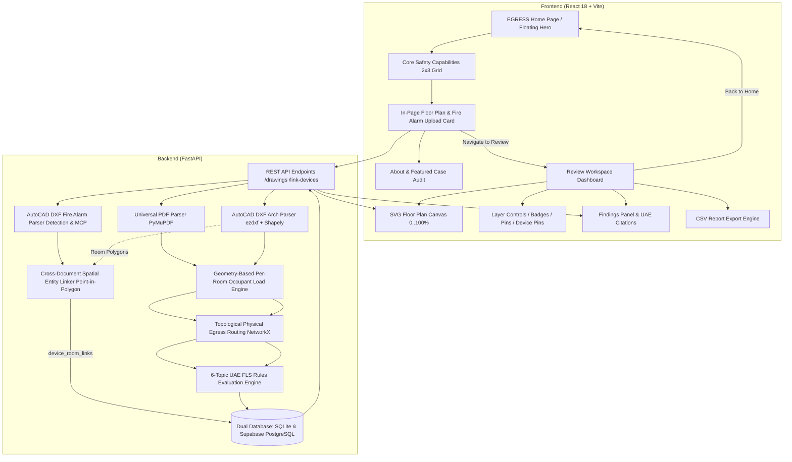

# EGRESS — Automated Fire & Life Safety Compliance Engine

**EGRESS** is an automated Fire & Life Safety (FLS) egress compliance review platform designed for commercial architectural floor plans. Built to evaluate building drawings against the official **UAE Fire and Life Safety Code of Practice (`CDGH-OP-25`, September 2018 Edition, 1,348 pages)**, the platform parses AutoCAD DXF and vector PDF drawings, derives shortest walkable escape routes, calculates occupant load distributions, flags clause-cited safety violations, and presents findings on an interactive, pixel-aligned blueprint overlay.

---

## 🌟 Key Highlights & Platform Architecture

- 🏛️ **Modern Architectural Home Experience**:
  - **Luminous Crimson Ambient Framing**: The hero card is framed by an abstract dark crimson backdrop ([`abstract_dark_crimson.jpg`](file:///e:/Firemoney/src/assets/abstract_dark_crimson.jpg)) with a dedicated blur layer (`blur(8px)`), radial ambient lighting, and high-contrast saturation.
  - **Floating Hero Card**: High-resolution architectural dusk brick facade ([`hero_brick_building.jpg`](file:///e:/Firemoney/src/assets/hero_brick_building.jpg)) with dark vignette framing, fluid entrance animations, and top navigation.
  - **Docked 3-Column Frosted Glass Bar**: Real-time summary of Compliance Precision, Architectural Safety, and Civil Defense Sign-off with dark frosted glassmorphism (`backdrop-filter: blur(20px)`).
- 📐 **Streamlined, Natural Section Flow**:
  1. **1st — Hero Section**: Floating card, bold headline with light italic contrast, quick tour button, and docked 3-column glass bar.
  2. **2nd — Safety Capabilities**: 2x3 interactive compliance grid covering the 6 core UAE FLS safety modules.
  3. **3rd — Upload Floor Plan**: In-page dropzone (`.dxf`, `.pdf`), occupancy density selector, sprinkler system toggle, and instant audit triggers.
  4. **4th — About EGRESS & Featured Case Study**: Engineering overview and Al Noor Business Centre Level 06 featured audit framed in faceted crimson.
  5. **5th — Assurance & Contact Bar**: Dubai Future District credentials (`+971 4 382 7000`) and UAE FLSC 2018 certification credentials.
- 🔤 **Standard Typography & Weight Hierarchy**:
  - **Standard Modern Typefaces**: Built using **Plus Jakarta Sans**, **Inter**, and **JetBrains Mono** for maximum accessibility and readability across all devices.
  - **Rich Weight System**: Extra Bold (`800`) headlines, Bold (`700`) CTAs, Semibold/Medium (`500`/`600`) chips and nav items, Regular (`400`) reading text, and Light (`300`) *Italics* for elegant emphasis and code citations.
- ✨ **Fluid Micro-Interactions & Animation Flow**:
  - **Navigation Underlines**: Expanding crimson underlines on hover (`scaleX(0) → scaleX(1)` with cubic-bezier easing).
  - **Shimmer Light Sweep**: Animated luxury light sweep (`@keyframes shimmerSweep`) across primary buttons on hover.
  - **3D Card Elevation**: Capabilities cards elevate (`translateY(-6px)`), illuminate a bottom red indicator, and tilt/scale icons on hover.
  - **Tactile Feedback**: Spring bounce press states (`:active`) on buttons and cards.
  - **Dropzone Interaction**: Smooth pulse border glow and floating icon bounce on file drag/hover.
- 📱 **Multi-Device Responsive System**:
  - Seamless adaptation across Desktop (`>1200px`), Laptops & Tablets (`769px–1024px`), Mobile Phones (`≤768px`), and Small Devices (`≤480px`).
  - Fluid typography, adaptive grid columns, full-width touch targets, and stacked layout flows.
- 🚨 **Phase 2b Fire Alarm Shop Drawing Integration**: Ingestion of MEP CAD shop drawings (`.dxf`), vector block extraction for detection and notification appliances (Smoke Detectors `SD`, Heat Detectors `HD`, Manual Call Points `MCP`, Sounders `SND`, Fire Alarm Control Panels `FACP`).
- 🎯 **Strict Floor-Pinned Cross-Document Entity Linking**: Enforced target `architectural_drawing_id` upload parameter and deterministic point-in-polygon algorithm matching fire alarm device coordinates into exact architectural room boundaries (`device_room_links`), with zero risk of cross-floor false matching.
- ⚡ **Dedicated Review Workspace Dashboard**: Full-screen CAD vector and PDF floor plan inspection interface with layer controls, numbered hazard pins (1..4), UAE code citations, status toggles (`Confirm`, `False Positive`, `Resolve`), and CSV export.
- 🏢 **Multi-Floor Building Decoding**: Upload single-page or multi-page PDF floor plan sets (`Dubai_Commercial_Building_FLS_Test_FloorPlans.pdf`); every level (Ground, Typical 01–03, Executive 04) is decoded and evaluated in a single batch.
- 📐 **Unified 0..100% Coordinate System**: Mathematically unified coordinate pipeline across PDF vector extraction, DXF CAD parsing, NetworkX topological routing, and SVG rendering for pixel-perfect overlay alignment.
- 🚶 **Topological Walkable Egress Routing**: Deterministic shortest-path network routing from each room centroid to emergency exits via circulation corridors.
- 📜 **168 Official UAE FLS Code Clauses**: Complete, structured machine-readable dataset extracted from all 20 chapters and annexures of the 1,348-page UAE Code of Practice.
- 🗄️ **Dual-Engine Production Database**: Seamless SQLite and Supabase PostgreSQL compatibility with zero schema drift, automatic `device_room_links` migrations, and persistent file binary mirrors.

---

## 🚀 Quick Start

### 1. Backend Service (FastAPI + SQLite)

Requires Python 3.11+.

```powershell
# 1. Create & activate Python virtual environment
python -m venv backend/.venv
.\backend\.venv\Scripts\Activate.ps1

# 2. Install dependencies
pip install -r backend\requirements.txt

# 3. Seed the 168 UAE FLS Code Clauses into SQLite
python backend\seed_code_clauses.py

# 4. Launch the API server
uvicorn app.main:app --app-dir backend --host 127.0.0.1 --port 8000 --reload
```

- **API URL**: `http://127.0.0.1:8000`
- **Interactive Swagger Documentation**: `http://127.0.0.1:8000/docs`
- **Code Clauses Endpoint**: `http://127.0.0.1:8000/code-clauses`
- **Database Location**: `backend/data/fls_demo.db`

---

## 🌐 Live Cloud Deployment & Online Production Version

EGRESS is deployed in production with continuous integration and continuous deployment (CI/CD) across multi-cloud infrastructure:

| Component | Cloud Platform | Live Production URL | Description & Resilience |
| :--- | :--- | :--- | :--- |
| **Frontend Web App** | **Vercel** | [**https://egress-jade.vercel.app/**](https://egress-jade.vercel.app/) | Global edge-cached React 18 SPA with automatic preview builds and instant zero-latency floor navigation. |
| **API & Analysis Engine** | **Render** | [**https://egressandco.onrender.com**](https://egressandco.onrender.com) | Python FastAPI container running PyMuPDF, Ezdxf, Shapely, and NetworkX topological analysis. |
| **Interactive API Docs** | **Render Swagger** | [**https://egressandco.onrender.com/docs**](https://egressandco.onrender.com/docs) | Live OpenAPI / Swagger UI testbed for executing statutory compliance checks directly. |
| **Persistent Storage** | **Supabase PostgreSQL** | Integrated via SSL Pooler | Persistent database storing drawings, floor files (`drawing_files` binary storage), and UAE FLS code clauses across container restarts. |

### Production Architecture & Cloud Capabilities

1. **Continuous Deployment via GitHub**:
   - Pushing to the `master` branch triggers automatic production deployments on both **Vercel** (frontend build) and **Render** (backend container redeployment).
2. **Zero-Downtime Persistent File Storage**:
   - Render's ephemeral container storage is backed by **Supabase PostgreSQL**. Uploaded `.pdf` and `.dxf` drawing binaries are mirrored into the `drawing_files` table, ensuring drawings, high-resolution floor image renders, and audit records survive cloud container spin-downs and redeploys.
3. **High-Performance Multi-Floor In-Memory Caching**:
   - **Client-Side Cache (`floorCacheRef`)**: Pre-populates all building floor levels into client memory upon upload. Switching between floors (e.g. Ground, Level 01, Level 02, etc.) executes in `< 10ms` with zero UI freeze.
   - **Backend Cache (`_MULTI_FLOOR_CACHE` & `_IMAGE_CACHE`)**: Caches parsed GeoJSON features, UAE violation assessments, and PyMuPDF rendered raster backdrops in RAM to eliminate redundant re-analysis.
4. **Resilient Offline / Demo Fallback**:
   - If the cloud API is warming up or temporarily disconnected, the frontend seamlessly engages an offline fallback to ensure the interactive CAD viewer, demo project review, and CSV export functionality remain completely functional.

---

### 2. Frontend Application (React 18 + Vite)

Requires Node.js 18+.

```powershell
# 1. Install npm dependencies
npm install

# 2. Start Vite development server
npm run dev -- --host 127.0.0.1 --port 5173
```

- **Web App**: `http://127.0.0.1:5173`

> [!NOTE]
> Run both services for live drawing analysis and full database persistence. If the backend is temporarily offline, the frontend seamlessly falls back to demo fixtures, demo review mode, and client-side CSV export generation.

---

## 🧪 Automated Test Suites

Run the automated test runners to verify API endpoints, geometry extraction, rules engine evaluations, and multi-floor regression:

```powershell
# 1. Run the comprehensive 20-suite backend API test suite
.\backend\.venv\Scripts\python.exe backend/test_api.py

# 2. Run the Dubai 5-Floor regression test suite
.\backend\.venv\Scripts\python.exe backend/test_dubai_regression.py

# 3. Run the multi-floor PDF decoding and error rollup test
.\backend\.venv\Scripts\python.exe backend/test_multi_floor_summary.py

# 4. Run the 12-floor CAD DXF & PDF validation runner
.\backend\.venv\Scripts\python.exe backend/validate_all_floors.py

# 5. Run coordinate precision and spatial bounding box validation
.\backend\.venv\Scripts\python.exe backend/test_coordinate_accuracy.py

# 6. Run Phase 2b Fire Alarm vector symbol extraction test suite
.\backend\.venv\Scripts\python.exe backend/test_fire_alarm_extraction.py

# 7. Run Phase 2b Cross-Document spatial entity linking test suite
.\backend\.venv\Scripts\python.exe backend/test_cross_document_linking.py

# 8. Build frontend production bundle
npm run build
```

---

## 🏛️ System Architecture



---

## 📜 UAE Fire & Life Safety Code Database (1,348 Pages)

The platform incorporates a structured, machine-readable dataset extracted directly from the **UAE Fire and Life Safety Code of Practice (`CDGH-OP-25`, 1,348 pages)**:

* **Primary Dataset File**: [`backend/data/uae_fls_code_clauses_business_occupancy.json`](file:///e:/Firemoney/backend/data/uae_fls_code_clauses_business_occupancy.json) (168 structured clauses)
* **Master Source PDF**: [`floor plan/UAE Fire and Life Safety Code of Practice.pdf`](file:///e:/Firemoney/floor%20plan/UAE%20Fire%20and%20Life%20Safety%20Code%20of%20Practice.pdf)

### Rules Engine Topics Evaluated

The rules engine dynamically checks 6 primary egress compliance topics against official UAE FLS clauses:
1. **`travel_distance_to_exit`**: Table 3.16 ($91.0\text{ m}$ sprinklered / $61.0\text{ m}$ non-sprinklered for Business).
2. **`two_exit_doors_required_by_area`**: Table 3.19 ($280.0\text{ m}^2$ for Business) & Table 3.20 ($93.0\text{ m}^2$ for Educational).
3. **`single_exit_door_permission`**: Table 3.19 Item 1.i ($<100\text{ persons}$ limit with exterior discharge $\le 30\text{m}$, [`UAE-FLS-3.19-BUS-SINGLE-DOOR`](file:///e:/Firemoney/backend/data/uae_fls_code_clauses_business_occupancy.json#L1242)).
4. **`number_of_exits`**: Table 3.14 (2 exits $<500\text{p}$, 3 exits $500\text{--}1000\text{p}$, 4 exits $>1000\text{p}$).
5. **`exit_corridor_width`**: Table 3.8 ($\ge 1200\text{ mm}$ minimum baseline and $\ge N \times 5.0\text{ mm}$ capacity width).
6. **`exit_remoteness`**: Table 3.15.a ($\ge 0.333$ of floor diagonal for sprinklered / $\ge 0.500$ for non-sprinklered).

---

## 📊 12-Floor Building Validation Matrix

Validation executed across all 12 commercial building floor plans (6 DXF levels + 6 PDF levels):

| Floor Plan / Level | Source Format | Rooms | Exits | Total Occupant Load | Max Travel Distance | Sprinklered Violations | Non-Sprinklered Violations | Status |
|---|---|---|---|---|---|---|---|---|
| **Level 00 (Ground Floor)** | CAD DXF | 10 | 2 | 39 p | 21.73 m | 0 | 0 | **COMPLIANT** |
| **Level 01 (Typical Office)** | CAD DXF | 10 | 2 | 158 p | 21.70 m | 0 | 0 | **COMPLIANT** |
| **Level 02 (Typical Office)** | CAD DXF | 10 | 2 | 158 p | 21.70 m | 0 | 0 | **COMPLIANT** |
| **Level 03 (Typical Office)** | CAD DXF | 10 | 2 | 158 p | 21.70 m | 0 | 0 | **COMPLIANT** |
| **Level 04 (Executive Floor)** | CAD DXF | 11 | 2 | 75 p | 19.87 m | 0 | 0 | **COMPLIANT** |
| **Level 05 (Diagnostic Floor)** | CAD DXF | 4 | 1 | 79 p | 31.33 m | 2 | 2 | **NON-COMPLIANT (Flagged)** |
| **Level 02 (Layout Plan)** | PDF Vector | 5 | 2 | 360 p | 14.28 m | 1 | 1 | **NON-COMPLIANT (Flagged)** |
| **Level 00 (PDF Set Page 0)** | Multi-page PDF | 10 | 4 | 69 p | 13.19 m | 0 | 0 | **COMPLIANT** |
| **Level 01 (PDF Set Page 1)** | Multi-page PDF | 10 | 2 | 158 p | 18.69 m | 0 | 0 | **COMPLIANT** |
| **Level 02 (PDF Set Page 2)** | Multi-page PDF | 10 | 2 | 158 p | 18.69 m | 0 | 0 | **COMPLIANT** |
| **Level 03 (PDF Set Page 3)** | Multi-page PDF | 10 | 2 | 158 p | 18.69 m | 0 | 0 | **COMPLIANT** |
| **Level 04 (PDF Set Page 4)** | Multi-page PDF | 11 | 2 | 136 p | 18.53 m | 1 | 1 | **NON-COMPLIANT (Flagged)** |

---

## 🚨 Phase 2b: Fire Alarm Shop Drawing Integration & Cross-Document Linking

EGRESS Phase 2b expands the compliance platform from architectural means of egress to **Fire Alarm CAD Shop Drawings (`.dxf`)** with automated cross-document spatial entity linking against architectural floor plan geometry:

### 1. Vector Device & Symbol Extraction
* **Detection & Notification Appliances**: Automatically identifies and extracts block inserts, attributes, and text symbols:
  - `smoke_detector` (`SD`)
  - `heat_detector` (`HD`)
  - `manual_call_point` (`MCP`)
  - `sounder` (`SND` / `AVS`)
  - `fire_alarm_panel` (`FACP`)
* **Precision Spatial Coordinates**: Extracts real CAD metric coordinates (`x_m`, `y_m`), raw insertion vectors, device tags, and normalized SVG canvas positions (`svg_x`, `svg_y`).

### 2. Strict Floor-Pinned Cross-Document Entity Linking
To guarantee physical compliance fidelity under UAE Fire Code Chapter 8, fire alarm drawings cannot silently pick an arbitrary architectural drawing.
* **Mandatory Floor Targeting**: `POST /projects/{project_id}/drawings` strictly requires `architectural_drawing_id` when uploading a `fire_alarm` drawing. Omitting or providing an invalid architectural drawing ID immediately aborts with **HTTP 400**.
* **Deterministic Point-in-Polygon Assignment**: Device coordinates are evaluated against architectural room boundary polygons using Shapely. If contained or touching, the device links to that exact room; otherwise, it is categorized as circulation (`unassigned - corridor`).
* **Relinking Endpoint**: `POST /drawings/{fa_drawing_id}/link-to-architectural/{arch_drawing_id}` allows explicitly re-linking devices to alternate architectural revisions or levels.

### 3. Dual-Engine Persistence (`device_room_links`)
Results are persisted to the `device_room_links` table in SQLite and live **Supabase PostgreSQL**:

```sql
CREATE TABLE IF NOT EXISTS device_room_links (
  id TEXT PRIMARY KEY,
  project_id TEXT NOT NULL REFERENCES projects(id) ON DELETE CASCADE,
  device_element_id TEXT NOT NULL REFERENCES extracted_elements(id) ON DELETE CASCADE,
  device_drawing_id TEXT NOT NULL REFERENCES drawings(id) ON DELETE CASCADE,
  device_tag TEXT,
  device_type TEXT NOT NULL,
  room_element_id TEXT REFERENCES extracted_elements(id) ON DELETE SET NULL,
  room_drawing_id TEXT REFERENCES drawings(id) ON DELETE SET NULL,
  room_name TEXT NOT NULL,
  status TEXT NOT NULL,
  x_m REAL, y_m REAL, svg_x REAL, svg_y REAL,
  created_at TEXT NOT NULL
);
```

### 4. Level 01 Typical Verified Device-Room Linking Matrix (20 Devices)

Tested and verified against live production Supabase PostgreSQL for `Dubai_Commercial_Floor_Level_01_FireAlarm.dxf` targeting Level 01 Typical (`c4d18064-37c4-4002-b7cc-134ea78dcba2`):

| Device Tag | Device Type | Linked Room Name | Status | Target Architectural Drawing ID |
| :--- | :--- | :--- | :--- | :--- |
| **FACP-01** | `fire_alarm_panel` | **EXIT STAIR S-01 (WEST)** | `assigned_room` | `c4d18064-37c4-4002-b7cc-134ea78dcba2` |
| **HD-01** | `heat_detector` | **OPEN OFFICE CENTRAL** | `assigned_room` | `c4d18064-37c4-4002-b7cc-134ea78dcba2` |
| **MCP-01** | `manual_call_point` | `unassigned - corridor` | `unassigned_corridor` | `c4d18064-37c4-4002-b7cc-134ea78dcba2` |
| **MCP-02** | `manual_call_point` | `unassigned - corridor` | `unassigned_corridor` | `c4d18064-37c4-4002-b7cc-134ea78dcba2` |
| **MCP-03** | `manual_call_point` | `unassigned - corridor` | `unassigned_corridor` | `c4d18064-37c4-4002-b7cc-134ea78dcba2` |
| **SD-01** | `smoke_detector` | **MEETING ROOM 1B** | `assigned_room` | `c4d18064-37c4-4002-b7cc-134ea78dcba2` |
| **SD-02** | `smoke_detector` | **MEETING ROOM 1B** | `assigned_room` | `c4d18064-37c4-4002-b7cc-134ea78dcba2` |
| **SD-03** | `smoke_detector` | **MEETING ROOM 1C** | `assigned_room` | `c4d18064-37c4-4002-b7cc-134ea78dcba2` |
| **SD-04** | `smoke_detector` | **MEETING ROOM 1C** | `assigned_room` | `c4d18064-37c4-4002-b7cc-134ea78dcba2` |
| **SD-05** | `smoke_detector` | **MEETING ROOM 1D** | `assigned_room` | `c4d18064-37c4-4002-b7cc-134ea78dcba2` |
| **SD-06** | `smoke_detector` | `unassigned - corridor` | `unassigned_corridor` | `c4d18064-37c4-4002-b7cc-134ea78dcba2` |
| **SD-07** | `smoke_detector` | `unassigned - corridor` | `unassigned_corridor` | `c4d18064-37c4-4002-b7cc-134ea78dcba2` |
| **SD-08** | `smoke_detector` | **OPEN OFFICE CENTRAL** | `assigned_room` | `c4d18064-37c4-4002-b7cc-134ea78dcba2` |
| **SD-09** | `smoke_detector` | **OPEN OFFICE CENTRAL** | `assigned_room` | `c4d18064-37c4-4002-b7cc-134ea78dcba2` |
| **SD-10** | `smoke_detector` | **OPEN OFFICE EAST** | `assigned_room` | `c4d18064-37c4-4002-b7cc-134ea78dcba2` |
| **SD-11** | `smoke_detector` | `unassigned - corridor` | `unassigned_corridor` | `c4d18064-37c4-4002-b7cc-134ea78dcba2` |
| **SD-12** | `smoke_detector` | `unassigned - corridor` | `unassigned_corridor` | `c4d18064-37c4-4002-b7cc-134ea78dcba2` |
| **SD-13** | `smoke_detector` | `unassigned - corridor` | `unassigned_corridor` | `c4d18064-37c4-4002-b7cc-134ea78dcba2` |
| **SND-01** | `sounder` | `unassigned - corridor` | `unassigned_corridor` | `c4d18064-37c4-4002-b7cc-134ea78dcba2` |
| **SND-02** | `sounder` | `unassigned - corridor` | `unassigned_corridor` | `c4d18064-37c4-4002-b7cc-134ea78dcba2` |

---

## 📁 Repository Structure

```text
src/
  ├── EgressHome.jsx           # Home landing page with floating hero card, capabilities grid, and upload workspace
  ├── main.jsx                 # Full review workspace dashboard, SVG vector canvas, and finding controls
  ├── egress.css               # EGRESS design system tokens, hero card framing, micro-interactions & responsive styles
  ├── styles.css               # Architectural review workspace styles, layer controls & modal styling
  └── assets/
      ├── hero_brick_building.jpg # Architectural hero card background (brick facade & dusk lighting)
      ├── hero_egress.jpg        # Engineering studio CAD workstation backdrop
      ├── abstract_dark_crimson.jpg # Dark faceted 3D ambient background for hero frame and case audit
      └── finance_desk.jpg       # Audit workstation desk backdrop
backend/
  ├── app/
  │   ├── __init__.py
  │   ├── db.py                # Dual-engine database adapter (SQLite & Supabase PostgreSQL with DictCursor)
  │   ├── dxf_parser.py        # CAD DXF geometry & fire alarm symbol parser (ezdxf + shapely)
  │   ├── pdf_parser.py        # PDF vector parser & coordinate extractor (pymupdf)
  │   ├── linking.py           # Cross-document spatial entity linking engine (point-in-polygon)
  │   ├── path_analysis.py     # Topological egress graph & shortest-path calculation (networkx)
  │   ├── occupant_load.py     # Per-room geometry-based occupant load calculator
  │   ├── rules_engine.py      # UAE FLS code compliance evaluation & violation generator (6 topics)
  │   └── main.py              # FastAPI routes, multi-floor summary engine, image rendering, CodeClause API
  ├── data/
  │   ├── fls_demo.db          # SQLite database (contains 168 code clauses, projects, drawings, findings)
  │   └── uae_fls_code_clauses_business_occupancy.json # 168 official UAE code clauses (Chapters 1-20)
  ├── scripts/
  │   ├── generate_fire_alarm_test_dxf.py # Fire alarm fixture generator with 20 devices
  │   └── verify_citations.py    # Automated citation spot-checker & source PDF evidence extractor
  ├── requirements.txt         # Python dependencies (ezdxf, shapely, networkx, pymupdf, fastapi, psycopg2)
  ├── test_api.py              # Automated API & regression test suite (20 test suites)
  ├── test_dubai_regression.py # Automated Dubai 5-floor building regression test suite
  ├── test_fire_alarm_extraction.py # Phase 2b fire alarm symbol extraction verification
  ├── test_cross_document_linking.py # Phase 2b cross-document entity linking & persistence test suite
  ├── test_multi_floor_summary.py # Automated multi-floor upload & summary validation
  ├── validate_all_floors.py   # Multi-floor building validation runner (DXF + PDF)
  └── test_coordinate_accuracy.py # PDF coordinate accuracy integration test
floor plan/                    # Sample commercial floor-plan PDFs, DXFs, and UAE FLS Master Code PDF
walkthrough.md                 # Guided feature walkthrough and verification report
README.md                      # Primary project overview and quick start guide
```

---

> [!NOTE]
> **Engineering & Compliance Notice**: This platform is designed as an automated pre-check engineering tool to assist architects and MEP/FLS consultants in preparing drawing submissions according to the UAE Fire and Life Safety Code of Practice (`CDGH-OP-25`). It does not replace formal Civil Defence authority review or licensed engineer of record certification.
